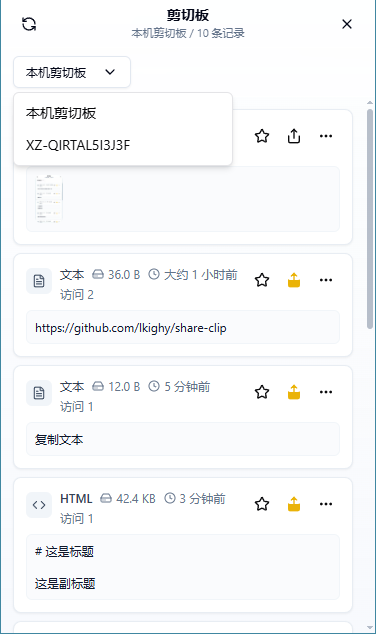
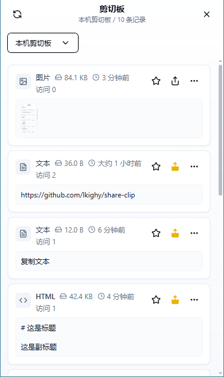
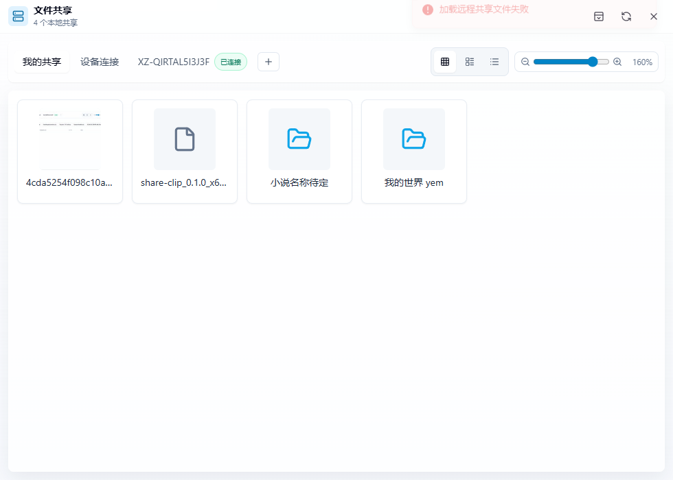
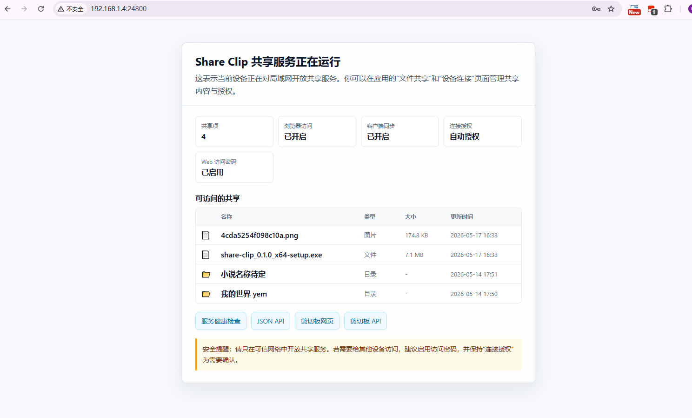
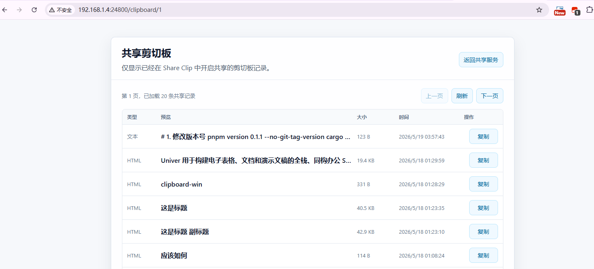

# 分享剪切板

[GitHub 仓库](https://github.com/lkighy/share-clip)

分享剪切板是一款桌面端剪切板与文件共享工具，用来在本机和可信设备之间快速保存、检索、粘贴与共享内容。应用基于 Tauri、Rust 和 React 构建，核心目标是让剪切板历史、跨设备文本/图片/文件流转，以及临时文件共享变得轻量、直接。

## 下载

发布版本会放在 GitHub Releases：

https://github.com/lkighy/share-clip/releases

当前项目仍处于早期阶段，建议优先使用预发布版本进行体验和反馈。

## 功能

- 剪切板历史记录：保存文本、HTML、RTF、图片和文件类剪切板内容。
- 快捷键唤出：通过全局快捷键快速打开剪切板窗口并粘贴目标内容。
- 远程剪切板浏览：连接可信设备后浏览远程剪切板记录，并支持复制或粘贴到本机。
- 文件共享：手动共享本地文件/文件夹，也支持由剪切板文件生成临时共享项。
- 远程文件同步：使用客户端流式传输同步远程文件，支持大文件、隐藏文件名、自选空文件夹同步和缓存位置变更。
- Web 访问：支持通过浏览器访问共享文件和分享剪切板，并提供访问授权与权限粒度控制。
- 设备连接授权：支持连接申请、授权状态管理和共享服务器访问控制。
- 缓存与清理：支持本地缓存、远程文件缓存、缓存位置调整、过期数据和失效数据清理。
- 日志排障：后端和前端日志统一写入本地日志目录，可在设置页中打开。

## 最近更新

### v0.4.0 - 远程文件同步与缓存位置增强

- 远程文件下载/同步改为客户端 Rust 流式传输，降低大文件下载失败和异常命名风险。
- 右键远程文件操作合并为统一的“同步”入口，未缓存时可使用“同步到”选择空文件夹。
- 已缓存远程文件/文件夹支持变更缓存位置，后续打开和同步会继续使用新位置。
- 保留 `.env` 等以点开头的隐藏文件名。

完整版本记录请查看 [CHANGELOG.md](CHANGELOG.md)。

## 界面预览

## 使用场景

- 在多个设备之间同步临时文本、图片或文件。
- 从剪切板历史中找回刚复制过的内容。
- 将本机文件快速暴露给局域网内已授权设备下载。
- 在不切换窗口焦点的情况下快速唤出剪切板并完成粘贴。

## Web 访问

启动共享服务器后，局域网内设备可以通过浏览器访问 Share Clip 的 Web 页面。默认端口为 `24800`，可在设置页调整绑定 IP 和端口。

- 共享首页：`http://<设备IP>:24800/`
- 剪切板页面：`http://<设备IP>:24800/clipboard/1`
- Web 授权页：`http://<设备IP>:24800/auth`

Web 访问默认需要授权。当前支持两种授权方式：

- 固定访问密码：适合自己的常用设备，在设置页启用并配置 Web 密码后，可在 `/auth` 页面输入密码完成授权。
- 临时确认授权：适合临时设备，在 `/auth` 页面发送授权请求后，需要在桌面端“文件共享 / 设备连接”中同意或拒绝。

授权成功后会写入 `HttpOnly` Cookie，默认 1 小时过期，可在设置页修改有效期。Web 权限可以按粒度控制：

- `files`：访问文件共享列表和目录。
- `clipboard_list`：查看分享剪切板列表。
- `clipboard_content`：读取具体剪切板内容。
- `download`：下载共享文件。

建议只在可信局域网内开启 Web 访问，并按实际需要启用最小权限。

## 当前状态

项目仍处于早期版本。Windows 路径是当前主要验证目标；Linux 和 macOS 的编译及系统级交互行为仍需要在真实环境中持续验证。

## 已知限制

- 部分带格式的数据在通过剪切板历史重新复制或粘贴后，可能无法完全保留原始格式。目前已知在 Word 中可能出现标题、字体、段落样式或其他富文本细节丢失的情况。
- 应用会尽量保存并回写文本、HTML 和 RTF 等标准剪切板格式，但某些软件还会使用私有剪切板格式，这类格式暂未完整快照保存。

## 构建与开发

编译、开发环境、发布流水线和数据库迁移说明请查看 [BUILD.md](https://github.com/lkighy/share-clip/blob/main/BUILD.md)。

## 反馈

问题反馈和功能建议请提交到 GitHub Issues：

https://github.com/lkighy/share-clip/issues

## 技术栈

- Tauri 2
- Rust
- React
- TypeScript
- Vite
- Tailwind CSS
- SeaORM + SQLite

## 许可证

暂未声明。
